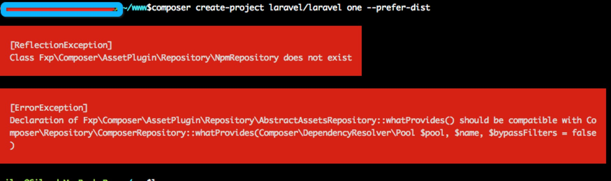
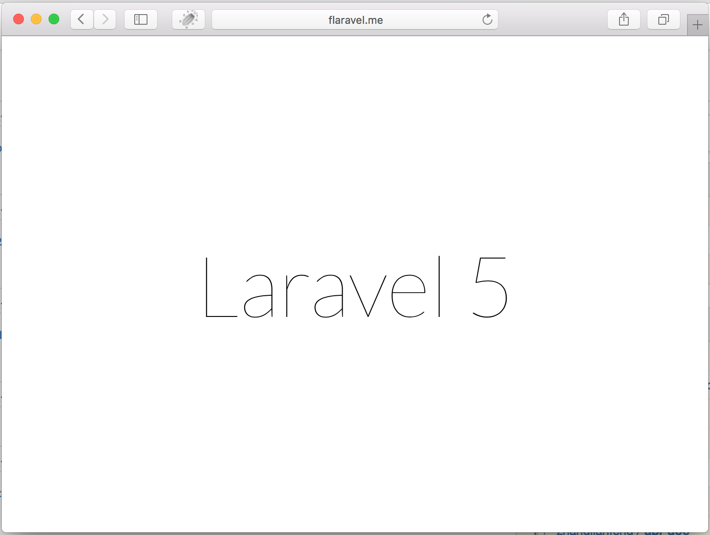
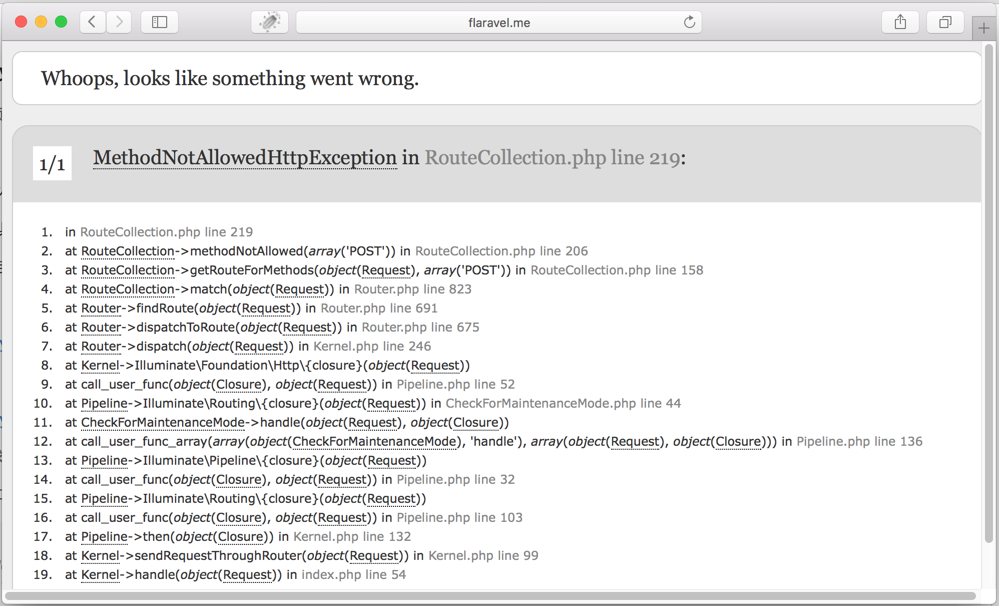
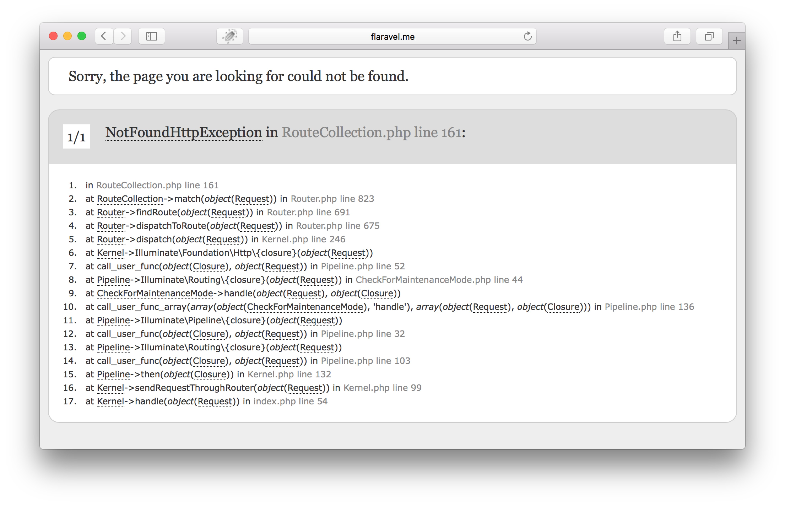
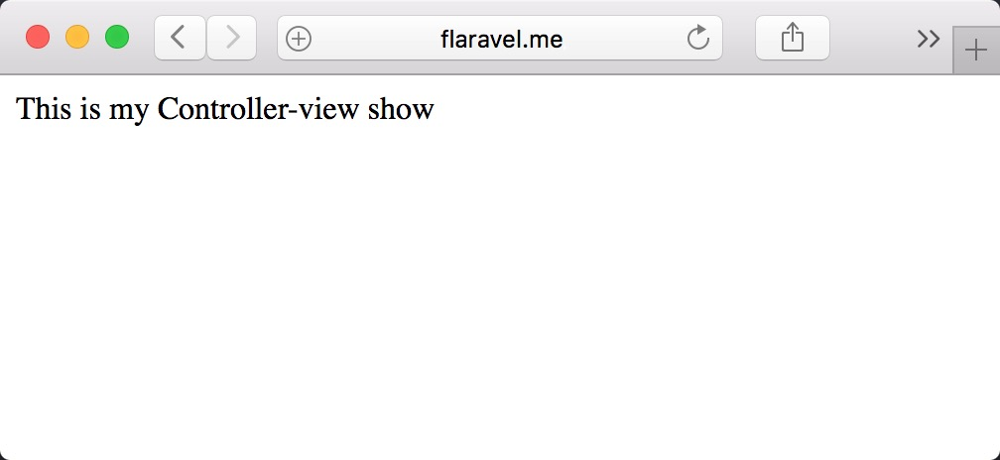
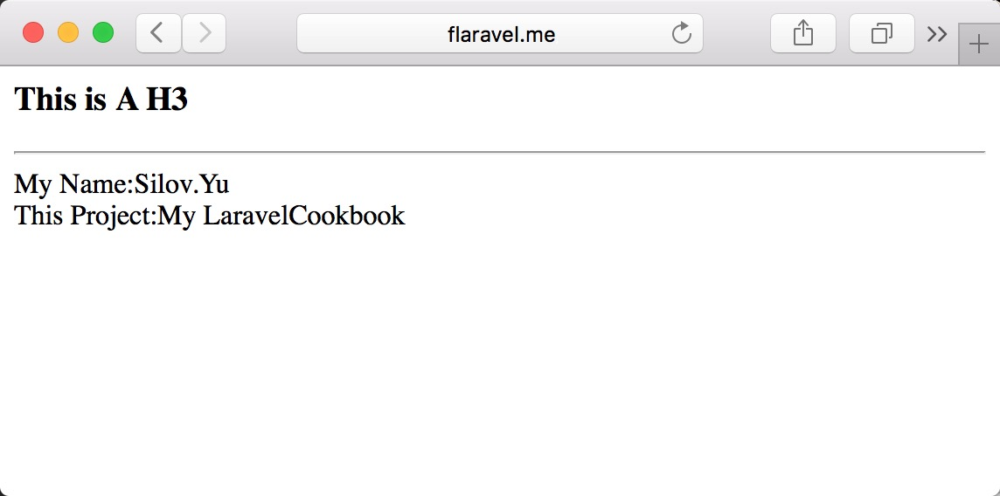

# Laravel学习笔记（一）框架搭建

#### 一、<span id="route-firstview">第一个laravel页面</span>

先了解第一个概念：composer

```    
Composer是 PHP 用来管理依赖（dependency）关系的工具。你可以在自己的项目中声明所依赖的外部工具库（libraries），Composer 会帮你安装这些依赖的库文件。
```

Composer的来源，在JohnLui的一片博文：[《利用 Composer 一步一步构建自己的 PHP 框架（一）——基础准备》](https://lvwenhan.com/php/405.html) 中有提到，需要了解的自行前往。

###### 第一步：安装Composer

```
curl -sS https://getcomposer.org/installer | php
mv composer.phar /usr/local/bin
```

传送门：[Composer中文网](http://docs.phpcomposer.com/)

###### 第二步：使用Composer初始化Laravel

选一个目录存放laravel代码，在这个目录下执行：

```
composer create-project laravel/laravel flaravel --prefer-dist
```

我在执行这句代码的时候出了个问题，报错如下：



如果你的命令执行正常，请绕路，如果跟我一样出现了这个问题，可尝试如下命令：

```shell
composer global require fxp/composer-asset-plugin —no-plugins
```

执行结束后重新执行`create-project`的命令，然后你会发现目录下多出了一个`flaravel`目录，这就是你的larave项目根目录。

```
·
├── app 项目代码目录
│   ├── Console
│   |   ├── commands 自定义命令
|   |   └── Kernel.php
│   ├── Events
│   ├── Exceptions
│   ├── Http
│   |   ├── Controllers 控制器
│   │   ├── Models 模型类
│   │   ├── Middleware 中间件
│   │   ├── Requests
│   │   └── routes.php 路由表
│   ├── Jobs
│   ├── Listeners
│   ├── Policies
│   ├── Providers
│   ├── filters.php 过滤器（拦截器）
│   ├── start
├── resources 静态资源
│   ├── assets
│   ├── lang 国际化支持
│   └── views 视图模板
├── bootstrap 启动相关脚本
├── config 配置目录
├── database 数据库相关，包括迁移脚本和数据导入脚本
├── public 静态资源目录
|   └── index.php [！！！！项目入口文件]
├── storage 临时文件、日志文件等
├── tests 单元测试用例
├── vendor 第三方依赖库
├── artisan 脚手架！重点工具
├── composer.json 项目依赖配置文件
├── phpunit.xml 单元测试配置文件
└── server.php
```

大概基本的代码结构是这样的。

###### 第三步：配置虚拟域名（Nginx）

比如我的代码存放位置是：

>   /Users/Admin/www/flaravel

借助JohnLui博文中的一句话：
``从使用框架是为了提高开发效率的角度来看，框架的本质就是路由。``

而路由除了本身代码之外还要借助Nginx一类的server来做另一件事：``将所有非静态文件全部指向 index.php``

如下是我的Nginx配置文件，我指定的虚拟域名是`flaravel.me`：

```shell
server {
    listen       80;
    server_name  flaravel.me;
    access_log  /tmp/flara.access.log  main;
	error_log /tmp/flara.error.log;
    location / {
        root   /Users/admin/www/one/public;
        index  index.php index.html index.htm;
	    try_files $uri $uri/ /index.php?$query_string;
	}
	location ~ \.php/?.*$ {
        root        /Users/admin/www/one/public;
        fastcgi_pass   127.0.0.1:9000;
        fastcgi_index  index.php;
        #加载Nginx默认"服务器环境变量"配置
        include        fastcgi.conf;

        #设置PATH_INFO并改写SCRIPT_FILENAME,SCRIPT_NAME服务器环境变量
        set $fastcgi_script_name2 $fastcgi_script_name;
        if ($fastcgi_script_name ~ "^(.+\.php)(/.+)$") {
            set $fastcgi_script_name2 $1;
            set $path_info $2;
        }
        fastcgi_param   PATH_INFO $path_info;
        fastcgi_param   SCRIPT_FILENAME   $document_root$fastcgi_script_name2;
        fastcgi_param   SCRIPT_NAME   $fastcgi_script_name2;
    }
    error_page   500 502 503 504  /50x.html;
    location = /50x.html {
        root   html;
    }
}
```

重新载入Nginx配置执行：

```
sudo nginx -s reload
```

在hosts文件中加入一条本地host：

```
127.0.0.1   flaravel.me
```

OK ,这时候访问浏览器（新的hosts记录可能需要重启浏览器才会生效）输入域名```flaravel.me```ok，第一个laravel欢迎页面出现了：




#### 二、<span id="route-easyuse">Laravel路由的简单应用</span>

###### 1.创建自己的页面

看下 ``app/Http/routes.php``文件的内容

```
Route::get('/', function () {
    return view('welcome');
});
```

解释：Laravel的路由在你访问域名根目录时，展示了welcome这个view的内容。get是限制访问页面的http方法。如果你改成post，刷新页面就变成了：



关于Http方法限制的问题，请参考RESTful Api的观念。

Laravel的route提供了post/get/put/delete四种基本的方法解析，如下：

```php
Route::get('/', function () {
    return 'Hello World';
});

Route::post('foo/bar', function () {
    return 'Hello World';
});

Route::put('foo/bar', function () {
    //
});

Route::delete('foo/bar', function () {
    //
});
```

以及match/any两种多http方法解析，入下：

```php
//match方法可配置几种方法：
Route::match(['get','post'], '/', function() {
    return "Hello World！";
});
//any方法是对所有http方法都解析，不区分
Route::any('/', function () {
    //
});
```

到这里，就可以在你的laravel中创建自己的各种新页面了。

###### 2.接收url中的参数，以及限制参数类型

有了页面，下一个步骤就是接收url中的参数，即get类型的参数

```php
Route::get('/article/{id}', function($id) {
    return $id;
});
```

好了，这样就可以接收到key为id的第一个参数了。

如果你要限制，id只能是数字，laravel也提供了很简单的方法：

```php
Route::get('/article/{id}', function($id) {
    return $id;
})->where('id', '[0-9]+');
```

如此，参数只可以遵循后面的正则规律。尝试一下设置规律之后传入不合法的参数看会发现什么：



OK，简单列一下路由的一些小用法：

（1）限制http方法

（2）限制参数类型

（3）可选参数、默认参数

```php
Route::get('user/{name?}', function ($name = null) {
    return $name;
});

Route::get('user/{name?}', function ($name = 'John') {
    return $name;
});
```

(4)路由命名

```php
Route::get('/specail/show', [
    'as'    => 'show',
    function() {
        echo "show";
    }
]);
```
意思就是`show`就成了`/specail/show`这个页面的路由别名，
```php
$url = URL::route('show'); //获取页面url
Redirect::route('show'); //重定向
```
这样就能取到这个页面的连接了。

#### 三、<span id="route-tocontroller">路由到Controller</span>

传送门：[laravel吐槽系列之一](http://www.cnblogs.com/yjf512/p/4031782.html)

这个吐槽里面提到了一点：Laravel没有默认路由。也就是说，不像其他开源框架，

```
http://domain/_Module_Name_/_controller_name_/_action_name_
```

这种访问方式，在laravel下面是不会自动解析定位到指定模块的指定controller下面的指定方法的。所有的页面访问，都需要在`routes.php`这个路由文件中进行“登记备案”，才能找到！

so，我们继续，如何在routes中将请求解析给相应的controller？

###### 1.一对一解析指定action

Routes.php
```php
Route::get('/test/index', 'TestController@index');
Route::get('/test/get/{id}', 'TestController@get');
```

Controllers/TestController.php

```php
namespace App\Http\Controllers;
use Illuminate\Routing\Controller as BaseController;
class TestController extends BaseController
{
    public function index()
    {
        echo "xxx";
    }
    public function get($id = 0)
    {
        echo $id;
    }
}
```

*注意：         
(1)所有Controller必须继承BaseController           
(2)形如get方法的参数，不设置默认值时为必须参数，设置默认值为可选参数*             

###### 2.对整个Controller一次性解析

如将上方Routes.php改写为如下格式：

```php
Route::controller('test','TestController');
```
此时，不再需要对TestController中的方法逐个解析路由，但是TestController中的方法名字需要做如下改动：

```
index()     => getIndex()
get($id=0)  => getGet($id=0)
```

即将方法名首字母大写之后前面加上HTTP方法名。

此时访问方式不变，不需要加http方法。

#### 四、<span id="route-tocontroller">Controller到view</span>

###### 1. 加载静态页面

当第一个welcome页面出来的时候，我们注意到`route.php`的第一个方法内容是这样的：
```php
return view('welcome');
```

so，view方法，就是渲染页面的方法。参数`welcom`指向的文件是：

>   ~/resources/views/welcome.blade.php

前文文档目录结构提到过，`~/resources/views/` 目录下面存放的是视图模板文件，而这里 `.blade.php` 中的 `blade` 是 Laravel 所提供的一个简单且强大的模板引擎。相较于其它知名的 PHP 模板引擎，Blade 并不会限制说你必须得在视图中使用 PHP 代码。所有 Blade 视图都会被编译缓存成普通的 PHP 代码，一直到它们被更改为止。这代表 Blade 基本不会对你的应用程序生成负担。Blade 视图文件使用 .blade.php 做为扩展名，通常保存于 resources/views 文件夹内。

传送门：[http://laravel-china.org/docs/5.1/blade](http://laravel-china.org/docs/5.1/blade)

这里先介绍一下blade以外的普通页面渲染方式。

一般来说，习惯上对于view文件，我会习惯根据Controller来分组文件夹管理，so，先在 `~/resources/views/` 目录下创建新目录：test， 然后在 `test` 中创建页面文件 `show.php` , 内容随便写点：

>	This is my Controller-view show

在TestController中编写方法：

```php
public function getShow()
{
    return view('test.show');
}
```

注意 `view('test.show')` 中的参数特点，以 `.` 作为目录分级的标识符。

然后访问页面：[http://flaravel.com/test/show](http://flaravel.com/test/show)

OK, That's It: 



###### 2. 数据展示：从controller传递数据给view

先来看下view方法的定义：

```php
function view($view = null, $data = [], $mergeData = [])
{
    $factory = app(ViewFactory::class);
    if (func_num_args() === 0) {
        return $factory;
    }
    return $factory->make($view, $data, $mergeData);
}
```

ok，view方法的第二个参数data应该就是要传递给页面上的了，尝试一下：

TestController:

```php
public function getShow()
{
    $data = [
        'name'  => 'Silov.Yu',
        'title'    => 'My LaravelCookbook'
    ];
    return view('test.show', $data);
}
```

~/resources/view/test/show.php 文件内容如下：

```html
<title>This is my Controller-view show</title>
<h3>This is A H3</h3>
<hr>

<label>My Name:</label><?=$name?><br>
<label>This Project:</label><?=$title?>
```
页面如下：

