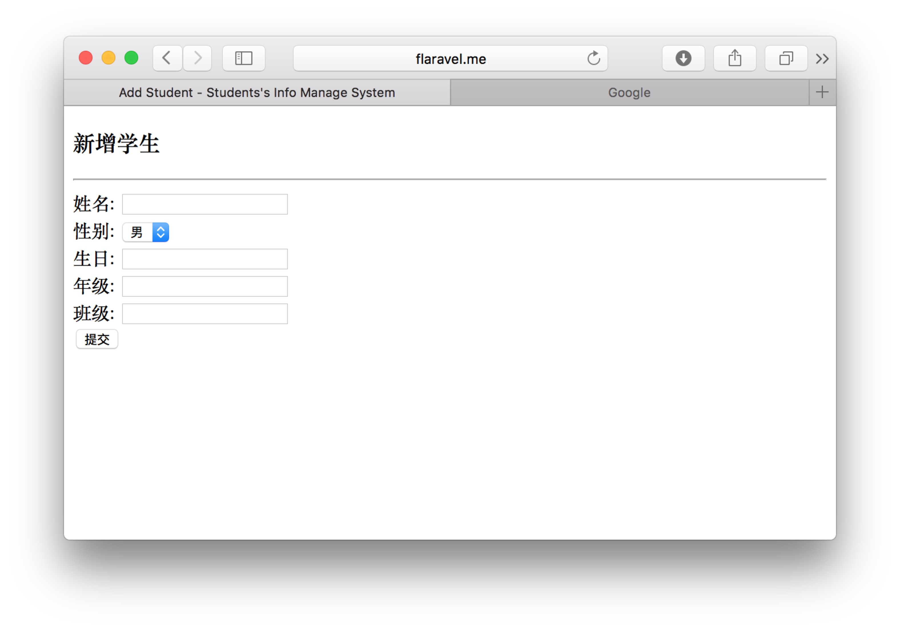
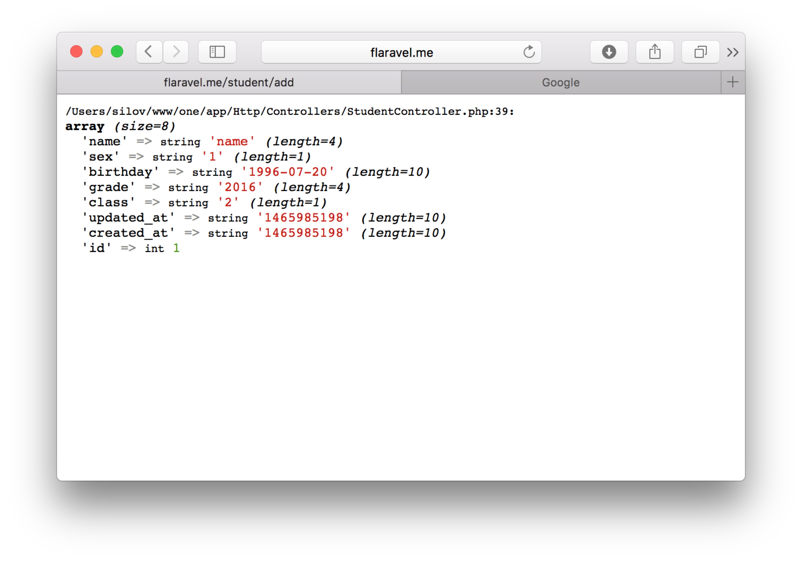
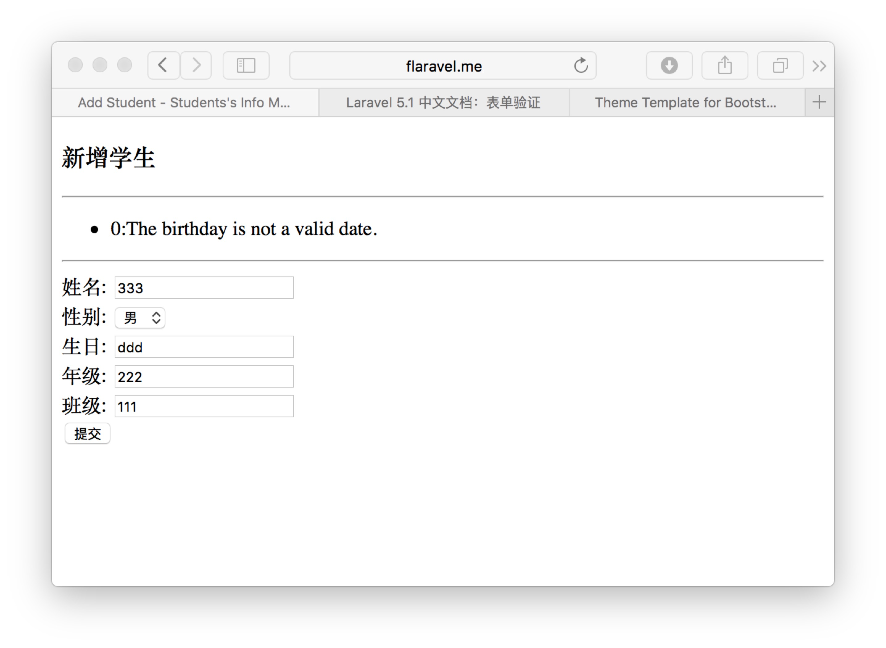
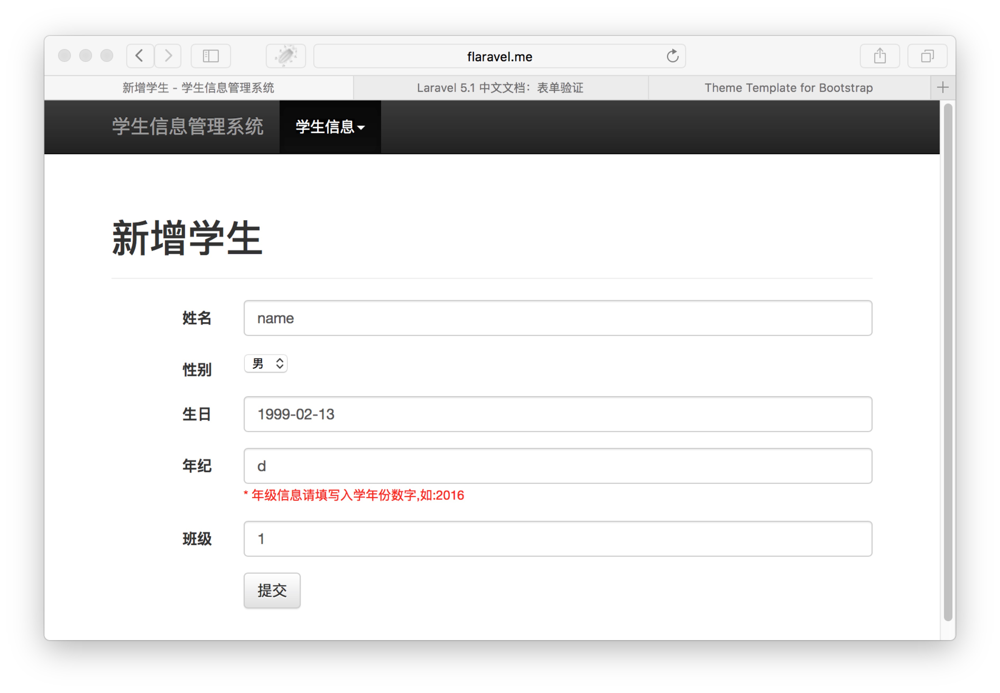
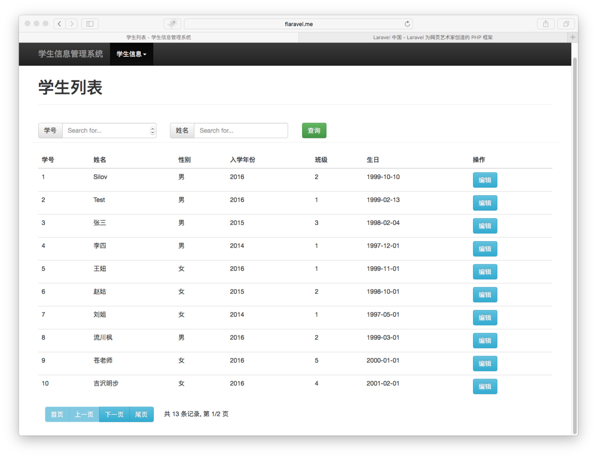

# Laravel 实战练习：学生信息管理系统

环境搭建、数据库配置依旧使用该学习文档中的一套，so，我的本地开发环境域名还是：http://flaravel.me

另外，项目代码在文档中无法全部粘贴，代码已另起一个项目上传，传送门：[laravelCookbookSourcecode](https://github.com/silov/laravelCookbookSourcecode)

#### 一、基础功能

###### 1. 设计学生信息表

```sql
CREATE TABLE `fl_students` (
  `id` int(11) NOT NULL AUTO_INCREMENT COMMENT 'ID as 学号',
  `name` varchar(30) NOT NULL DEFAULT '' COMMENT '姓名',
  `sex` tinyint(3) NOT NULL DEFAULT 1 COMMENT '性别：1-男，2-女',
  `birthday` date NOT NULL DEFAULT '0000-00-00' COMMENT '生日',
  `grade` int(5) NOT NULL DEFAULT 0 COMMENT '入学年份',
  `class` tinyint(3) NOT NULL DEFAULT 1 COMMENT '班级',
  `created_at` int(11) NOT NULL DEFAULT 0 COMMENT '创建时间',
  `updated_at` int(11) NOT NULL DEFAULT 0 COMMENT '更新时间',
  PRIMARY KEY (`id`)
) ENGINE=InnoDB DEFAULT CHARSET=utf8mb4 COMMENT='学生信息表';
```

（1）依旧 前缀 `fl_`, 数据库继续使用 `flaravel_db`        
（2）`created_at` . `updated_at` 字段，记录数据变化的时间，必备    

###### 2.创建Model

不确定我们的系统慢慢会不会需要两个数据库的程度，但是为了良好的可拓展性和代码的高效重用，还是先设计一层Model基类，定义一些常规属性 `Models/BaseModel.php`：

```php
<?php
namespace App\Models;
use Illuminate\Database\Eloquent\Model;
class BaseModel extends Model
{
    protected $connection = 'mysql';
    protected $dateFormat = 'U';
    public $timestamps = true;
}
```

继续，创建 `Models/Student.php` :

```php
<?php
namespace App\Models;
class Student extends BaseModel
{
    protected $primaryKey = 'id';
    protected $table = 'students';
}
```

可以看到这里我们继承的是BaseModels，而BaseModels中定义的属性除非特殊也不再重新定义。

###### 3.创建Controller，并添加统一route 

创建Controller文件 `app/Http/Controllers/StudentController.php` ：

```php
<?php
namespace App\Http\Controllers;
use Illuminate\Http\Request;
use App\Http\Requests;
class StudentController extends Controller
{
    //
}
```

或者使用脚手架，在根目录下执行命令行：

```shell
php artisan make:controller StudentController
```

然后，在 `routes.php` 中添加对该Controller的监听：

```php
Route::controller('student', 'StudentController');
```

OK,添加完成，可在Controller中添加如下方法看是否可以访问：

```php
public function getIndex(){echo "Student.Index";}
```
然后访问 http://flaravel.me/student/ 看能否打印出内容就好了~

###### 4.新增学生页面

首页需要一个数据入口页面：

```php
# StudentController
public function getAddv()
{
    return view("student.addv");
}
```

`resources/views` 目录下，创建 `student` 子目录，并创建 `student/addv.blade.php` 文件

内容如下：

```html
<!DOCTYPE html>
<html>
<head>
    <title>Add Student - Students's Info Manage System</title>
</head>
<body>
<div class="container">
    <div class="content">
        <h3>新增学生</h3>
        <hr>
        <form method="post" action="/student/add">
            <label>姓名:</label>
            <input type="text" name="name" /><br>
            <label>性别:</label>
            <select name="sex">
                <option value="1">男</option>
                <option value="2">女</option>
            </select><br>
            <label>生日:</label>
            <input type="text" name="birthday"/><br>
            <label>年级:</label>
            <input type="text" name="grade"/><br>
            <label>班级:</label>
            <input type="text" name="class"/><br>
            <input type="submit" value="提交">
            {{csrf_field()}}
        </form>
    </div>
</div>
</body>
</html>
```

如此，访问 `http://flaravel/student/addv` ，页面如下：



然后，再在Controller中添加一个方法 `postAdd(Request $request)` ：

```php
public function postAdd(Request $request)
{
    $params = $request->all();

    $student = new Student;
    $student->name  = $params['name'];
    $student->sex   = $params['sex'];
    $student->birthday  = $params['birthday'];
    $student->grade     = $params['grade'];
    $student->class     = $params['class'];
    $student->save();
    var_dump($student->toArray());
}
```
使用Model `Student` ,记得添加`use` : 

```
use App\Models\Student;
```

然后，你可以在页面上填写数据（尚未做数据校验，请填写合法数据）并提交，页面显示是这样的：



忽略第一行的 `var_dump` 提示,会发现返回的内容是你提交之后数据库里整个保存的样子：`id/updated_at/created_at` 等字段均已自动补齐。这表明，数据已经成功存储到数据库中了~

But。。。。

个人提议，最好将创建数据的过程，在Model中重新封装一下，我是这么做的：

```php 
# app/Models/Student.php
public function addStudent($name, $sex = 1, $birthday = '0000-00-00', $grade = 1, $class = 1)
{
    $student = new static;
    $student->name      = $name;
    $student->sex       = $sex;
    $student->birthday  = $birthday;
    $student->grade     = $grade;
    $student->class     = $class;
    $student->save();
    return empty($student->id) ? false : $student->toArray();
}
```

so，`StudentController` 中的 `postAdd` 方法变成了这样：

```php
public function postAdd(Request $request)
{
    $params = $request->all();
    $studentModel = new Student();
    $student = $studentModel->addStudent($params['name'], $params['sex'], $params['birthday'], $params['grade'], $params['class']);
    var_dump($student);
}
```

看起来简单了不少。。。

But，上面说了，没做数据校验，那，校验一下怎么做呢？

###### 5.表单数据校验

文档传送门：[Laravel 表单验证](http://laravel-china.org/docs/5.1/validation)

这里，非AJAX请求的话，推荐一种方式：

```php
public function postAdd(Request $request)
{
	//定义数据校验规则
	$rules = [
		'name'  => 'required|max:30',
		'sex'   => 'required|integer|between:1,2',
		'birthday'  => 'required|date',
		'grade' => 'required|int',
		'class' => 'required|int'
	];
	//校验数据
	$this->validate($request, $rules);
	
	//校验通过后的数据处理
	...
}
```

其中 `rules` 中的数据校验规则，参考上面Laravel表单验证传送门的列表。

这里可以查看 `ValidatesReuqest` 中 `validate` 方法的定义，再处理失败时，会直接抛出异常，并返回数据来源页面。

所以，在 `student.addv` 这个页面上，还要做两件事：

* 显示数据校验错误信息 : validator 已经定义的 $error 对象
	
	```
	@if (count($errors) > 0)
        <div class="alert alert-danger">
            <ul>
                @foreach ($errors->all() as $k=>$error)
                    <li>{{$k}}:{{ $error }}</li>
                @endforeach
            </ul>
        </div>
        <hr>
    @endif
	```
* 回填数据 : `old` 方法
	
	```
    <input type="text" name="name" value="{{ old('name') }}"/>
	```

校验失败后页面如下：



OK，下一步，调整顺序：将不合法数据信息，显示在对应的输入位置:

```
<input type="text" name="name" value="{{ old('name') }}"/>
{{$errors->first('name')}}
```

再下一步：把英文默认提示，改成中文？暨：自定义错误提示内容。

```php
# StudentController . postAdd
$rules = [
    'name'  => 'required|max:30',
    'sex'   => 'required|between:1,2',
    'birthday'  => 'required|date',
    'grade' => 'required|integer',
    'class' => 'required|int'
];
$messages = [
    'required'      => '* 不能为空!',
    'name.max'      => '* 学生姓名长度过大',
    'sex.between'   => '* 性别填写错误',
    'birthday.date' => '* 生日格式应为 YYYY-mm-dd',
    'grade.integer' => '* 年级信息请填写入学年份数字,如:' . date('Y'),
    'class.integer' => '* 班级信息请填写班级数字'
];
$this->validate($request, $rules, $messages);
```

如上，自定义错误信息的两种方式：

* 按类别自定义，如

	```
	'required'	=> ':attribute 不能为空'
	```
* 具体字段、具体错误类型自定义，如
	
	```
	'birthday.date' => '* 生日格式应为 YYYY-mm-dd'
	```

至此，表单验证部分搞定。

###### 6.Blade模板简介

我们的页面中，像 `<head>` 这一类的标签，以及可能会有的头部导航栏等等，几乎所有页面都会出现的东西，没必要每个页面写一次。而且，目前这样的页面，也。。。着实有点丑。。。

Blade 是 Laravel 所提供的一个简单且强大的模板引擎。相较于其它知名的 PHP 模板引擎，Blade 并不会限制说你必须得在视图中使用 PHP 代码。所有 Blade 视图都会被编译缓存成普通的 PHP 代码，一直到它们被更改为止。这代表 Blade 基本不会对你的应用程序生成负担。Blade 视图文件使用 `.blade.php` 做为扩展名，通常保存于 `resources/views` 文件夹内。

这里先介绍一下 layout 布局功能。

创建文件 `resources/views/layout/default.blade.php` ,内容如下：

```
<html>
<head>
    <title>@yield('title') - 学生信息管理系统</title>
    <meta charset="utf-8">
</head>
<body>
<div class="container">
    @yield('content')
</div>
</body>
</html>
```

对应的，`resources/views/student/addv.blade.php` 内容，处理成如下：

```
@extends('layout.default')
@section('title', '新增学生')
@section('content')
<div class="content">
    <h3>新增学生</h3>
    <hr>
    @if (count($errors) > 0)
        <div class="alert alert-danger">
            <ul>
                @foreach ($errors->all() as $error)
                    <li>{{ $error }}</li>
                @endforeach
            </ul>
        </div>
        <hr>
    @endif
    <form method="post" action="/student/add">
        <label>姓名:</label>
        <input type="text" name="name" value="{{ old('name') }}"/>
        {{$errors->first('name')}}
        <br>
        <label>性别:</label>
        <select name="sex">
            <option value="1">男</option>
            <option value="2">女</option>
        </select>
        <br>
        <label>生日:</label>
        <input type="text" name="birthday" value="{{ old('birthday') }}"/>
        <br>
        <label>年级:</label>
        <input type="text" name="grade" value="{{ old('grade') }}"/>
        <br>
        <label>班级:</label>
        <input type="text" name="class" value="{{ old('class') }}"/>
        <br>
        <input type="submit" value="提交">
        {{csrf_field()}}
    </form>
</div>
@endsection
```

如此，刷新下页面，可以看到显示正常咯~


###### 7.使用Bootstrap美化页面

页面 still 丑。。。干脆引入前端框架 `Bootstrap` 

传送门 ： [模板参考](http://v3.bootcss.com/examples/theme/)

参考如上模板，右键查看源代码，将源代码及其相关css、js文件等一并撸下来，css、js文件存放位置在 `public` 目录下，新建目录 `public/static/bootstrap`,按照模板中的书序，`bootstrap` 下初始文件格局如下：

```
bootstrap/
├── assets/ 
│   └── js/   	#模块化处理js
├── dist/
│   └── css/  	#统一样式css
├── css/		#自定义主题css
├── js/  		#自定义js	 
└── images/		#自定义图片资源
```

参考网页源码布局，去掉内容部分，重写头部导航栏等，重写静态资源路径，将其整理成 `layout/boot.blade.php` 模板文件

具体静态资源及模板文件情况请 下载 [本项目源码](https://github.com/silov/laravelCookbookSourcecode)

而后，对 `addv.blade.php` 内容也再次修改，添加 bootstrap 元素class，美化页面，同时给生日字段添加时间选择器插件：



###### 8.学生列表查询

有了新增页面，请先肆无忌惮的新增十几条各种学生数据。

我新增的结果是这样的：

```
mysql> select * from fl_students;
+----+-----------------+-----+------------+-------+-------+------------+------------+
| id | name            | sex | birthday   | grade | class | created_at | updated_at |
+----+-----------------+-----+------------+-------+-------+------------+------------+
|  1 | Silov           |   1 | 1999-10-10 |  2016 |     2 | 1465986707 | 1465986707 |
|  2 | Test            |   1 | 1999-02-13 |  2016 |     1 | 1466061543 | 1466061543 |
|  3 | 张三            |   1 | 1998-02-04 |  2015 |     3 | 1466158933 | 1466158933 |
|  4 | 李四            |   1 | 1997-12-01 |  2014 |     1 | 1466158933 | 1466158933 |
|  5 | 王妞            |   2 | 1999-11-01 |  2016 |     1 | 1466158933 | 1466158933 |
|  6 | 赵姑            |   2 | 1998-10-01 |  2015 |     2 | 1466158933 | 1466158933 |
|  7 | 刘姐            |   2 | 1997-05-01 |  2014 |     1 | 1466158933 | 1466158933 |
|  8 | 流川枫          |   1 | 1999-03-01 |  2016 |     2 | 1466158933 | 1466158933 |
|  9 | 苍老师          |   2 | 2000-01-01 |  2016 |     5 | 1466158933 | 1466158933 |
| 10 | 吉沢明步        |   2 | 2001-02-01 |  2016 |     4 | 1466158933 | 1466158933 |
| 11 | 原央莎莉        |   2 | 1998-04-01 |  2015 |     1 | 1466158933 | 1466158933 |
| 12 | 樱木花道        |   1 | 1999-06-01 |  2016 |     3 | 1466158933 | 1466158933 |
| 13 | 野原新之助      |   1 | 1999-08-01 |  2015 |     2 | 1466158933 | 1466158933 |
+----+-----------------+-----+------------+-------+-------+------------+------------+
```

13个人，十人一页的话，差不多分页也可以做了~

第一件事，设计页面，查询条件：

*	学号:id         
* 	姓名:name      

So，这些都是 `Controller` 中需要考虑的查询参数。

第二件事，设计 `Model` 中的带翻页查询方法：

```php
# Models/Student.php
public function getList($condition = [], $order = [], $limit = 0, $offset = 0)
{
    $handler = $this;
    //查询条件
    if (!empty($condition)) {
        foreach ($condition as $field => $value) {
            if (is_array($value)) {
                $handler = $handler->where($field, $value['operator'], $value['value']);
            } else {
                $handler = $handler->where($field, $value);
            }
        }
    }
    //排序
    if (!empty($order)) {
        foreach ($order as $sortField => $sortType) {
            $handler = $handler->orderBy( $sortField, $sortType);
        }
    }
    // limit/offset
    if ($offset > 0) {
        $handler = $handler->skip($offset);
    }
    if ($limit > 0) {
        $handler = $handler->take($limit);
    }
    //取得查询结果并返回数组
    $result = $handler->get();
    return empty($result) ? [] : $result->toArray();
}
```

当然，你也可以把这些查询的过程、以及上文提到的create方法等业务逻辑处理过程都单独封装一层做 `Service` 层。这里暂且不提。

下一步，设计 `Controller` 中的 `action` 方法 

```
public function getList(Request $request)
{
    $params = $request->all();
    $page = empty($params['p']) ? 1 : intval($params['p']);
    $limit = 10;
    $offset = ($page - 1) * $limit;
    $order = [
        'id'    => 'asc'
    ];
    $condition = [];
    !empty($params['id']) && $condition['id'] = intval($params['id']);
    !empty($params['name']) && $condition['name'] = $params['name'];
    
    $model = new Student();
    $list = $model->getList($condition, $order, $limit, $offset);
    $total = $model->getCountByCondition($condition);
    $ret = [
        'total'         => (int)$total,
        'page_size'     => $limit,
        'page_count'    => ceil($total / $limit),
        'page'          => $page,
        'list'          => $list
    ];
    return view("student.list", $ret);
}
```

这里 `total/count/page_count` 等参数，都是翻页需要的。

前端代码不再详述，页面截图如下：

 

OK，列表页出来了，前面的新增数据中，`store` 方法的 `var_dump` 可以改成如下这样：

```
return redirect("/student/list");
```

即添加成功后直接跳转到列表页。

###### 9.删除学生：休学与退学

项目是为了练习，引入学生管理系统的概念是为了便于理解。这里也不刻板的去遵循现实了~

前面 `EloquentORM` 一节中提到过，删除分为直接删除数据和软删除两种。这里，以退学来演示直接删除数据，休学来展示软删除。前者数据不可恢复，后者数据仍然在，可恢复，只是标记删除状态而已。

首先，修改表结构，新增软删除字段：

```
alter table fl_students add column `deleted_at` int(11) not null default 0 COMMENT '软删除 -- 删除时间';
```

第二步，修改 `Models/Student`, 引入 `SoftDelete`

```
namespace App\Models;
use Illuminate\Database\Eloquent\SoftDeletes;
class Student extends BaseModel
{
	use SoftDeletes;
	...
}
```

**注：** `use` + `trait` 的用法，可以理解成PHP的多继承。详细请自行Google。

第三步，Model中定义软删除方法：//略过也可，直接在Controller中调用ORM的方法

```
public function softDeleteById($id)
{
	$obj = $this->find($id)->delete();     
	return $obj->trashed();
}
```

第四步，设计 `Controller` 中的 `ajax` 相应

提到 `ajax` ，先说一下 `Laravel` 中返回Json数据的方式：

```
$ret = [
	'status'	=> 200,
	'data'		=> [
		'result'	=> true
	],
	'msg'	=> 'success'
];
return response()->json($ret);
``` 

为了方便，我们需要一个更合适调用的Json数据返回方式。so，我们将 `Controller` 类，新增一个方法：

```
public function renderJson($code = 200, $data = [], $msg = '')
{
    $ret = [
        'status'    => $code,
        'data'      => empty($data) ? null : $data,
        'msg'       => $msg
    ];
    return response()->json($ret);
}
```
其中，各返回值的意义如下：

>|字段|意义|
|:--|:--|
|status|操作结果，200为成功，else异常| 
|data|status=200时才有，只操作成功时返回的下一步操作所需数据|
|msg|错误信息，status != 200时才有|

看项目需求和习惯，也可以拆分成两个：成功和错误，如下：

```
public function renderJson($data = []) {
	return response()->json(['status'=>200, 'data'=>$data]);
}
public function renderErrJson($code, $msg) {
	return response()->json(['status'=>(int)$code, 'msg'=>$msg]);
}
```

我这里用的是整合的一个。

OK，回到问题，我们现在需要的是删除、软删除的ajax操作，既然有删除、软删除，那么扩展一下，就会有四种情况至少：

* 退学(`destroy`)： 	直接彻底删除数据
* 休学(`soft_delete`)：	软删除数据
* 休学结束(`restore`)：	恢复软删除数据
* 先休学，后退学(`delete`)： 彻底删除一条已经软删除的数据

so，我们提供了四个关键词，作为四种操作类型，`action` 定义如下：

```php
public function getDeleteManage(Request $request)
{
    $params = $request->all();
    if (empty($params['action']) || empty($params['id'])) {
        return $this->renderJson(config('http_code.PARAMS_ERROR'), null, '参数不齐');
    }
    $model = new Student();
    switch ($params['action']) {
        case 'soft_delete': // 休学,软删除
            $res = $model->softDeleteById($params['id']);
            break;
        case 'destroy': // 直接退学,删除数据
            $res = $model->find($params['id'])->forceDelete();
            break;
        case 'restore': // 恢复软删除
            $res = $model->restoreById($params['id']);
            break;
        case 'delete': // 软删除数据彻底删除
            $res = $model->destroySoftdataById($params['id']);
            break;
        default:
            return $this->renderJson(config('http_code.PARAMS_ERROR'), null, '参数不齐');
            break;
    }
    if ($res) {
        return $this->renderJson(config('http_code.SUCCESS_CODE'), ['result' => true]);
    } else {
        return $this->renderJson(config('http_code.FAILED_NEED_REPEAT'), '操作失败,请重试');
    }
}
```

返回值虽然不太做得到 `RESTful API` 模式，但是尽量规范化一些~新建了一个 `app/config/http_code.php` 文件，配置返回值类型。然后使用 `config` 方法调用。

另外 `Ajax Post` 还有一个问题，就是 `_csrf` 验证，我使用的方法是：

头部添加这一行：

```
<meta name="csrf-token" content="{{ csrf_token() }}">
```

`JavaScript` 代码：

```javascript
function deleteManage(action, id) {
    var ajaxUrl = '/student/delete-manage';
    ...
    var postData = {
        action      : action,
        id          : id,
        _token      : $('meta[name="csrf-token"]').attr('content')
    };
    $.ajax({
        type : "POST",
        url  : ajaxUrl,
        data : postData,
        dataType : "json",
        success : function(res) {
            if (res.status == 200) {
                alert("操作成功!");
                window.location.reload();
            } else {
                alert(res.msg);
            }
        }
    });
}
```

PS:小细节，如果 `controller` 中的 `action` 方法是驼峰命名的，访问的时候需要将其变为小写并在驼峰处添加中划线 `-` 来访问，如：

```
# StudentController
function postDeleteManage(){}
```
访问URL：`http://flaravel.me/student/delete-manage` (`post` 表示请求的 `http` 方法，不在 `url` 中体现。

休学处理后，上一步中的学生列表将自动过滤软删除的数据，需要再做一个休学列表，对应恢复处理和休学转退学处理。这里不再赘述，想看的直接查代码~

